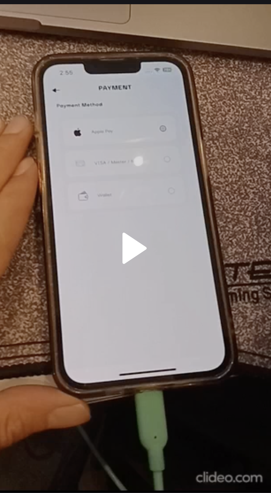

# hyper_pay_flutter_plugin


-----

-----


## Documenation 

[HyperPay Integration Guide](https://www.hyperpay.com/integration-guide/)


-----

-----

# GET START Hyper Pay Payment 

## Android Config

* Add JitPack to your build.gradle (Project-level) line :
```
 maven { url 'https://jitpack.io' } // important line
```

* example 
* 
```groovy

allprojects {
    repositories {
        google()
        mavenCentral()
        maven { url 'https://jitpack.io' } // important line
    }
}
```
in newer Gradle versions (settings.gradle or settings.gradle.kts), make sure JitPack is added like this:
gradle

```groovy
dependencyResolutionManagement {
    repositories {
        google()
        mavenCentral()
        maven { url 'https://jitpack.io' } // important line
    }
} 

```
 
-----

-----
 
## IOS Configuration

### VISA/MADA/MASTER

1- update cocoapods 
```
sudo gem install cocoapods
```

2- cd flutter project/
```

flutter clean
flutter pub get

```

3- cd projectPathFolder/ios/
```

rm -rf Podfile.lock Pods
pod install
pod install --repo-update
```

or

```
rm -rf Podfile.lock Pods 
pod install --repo-update
```

4- edit podfile :

* set the source of pods is  CocoaPods trunks, by write this in first lines in podfile
```
source 'https://github.com/CocoaPods/Specs.git' 
```
* set  platform sdk ios, to be written in first line of podfile
```
platform :ios, '15.0'
```

* set at last line of file podfile, the ios device min to run to be:
```  
post_install do |installer|
  installer.pods_project.targets.each do |target|
    flutter_additional_ios_build_settings(target)
    target.build_configurations.each do |config|
     config.build_settings['IPHONEOS_DEPLOYMENT_TARGET'] = '13.0'
    end
  end
end

```

5- set schema url , by editing file  info.plist :

* replace <<com.example.app>> with your bundle id then append with <<.payment>>

``` 
	<key>CFBundleURLTypes</key>
	<array> 
		<dict>
			<key>CFBundleTypeRole</key>
			<string>Editor</string>
			<key>CFBundleURLSchemes</key>
			<array>
				<string>com.example.myapp.payment</string>
			</array>
		</dict>
	</array>
```
* use this value "com.example.myapp.payment" to be set in
```
    var channelRequest = HyperpayChannelRequest ( );
    channelRequest.shopperResultUrl =   "com.example.myapp.payment";
```

* after adding schema you also need flutter clean second time
* cd flutter project/
```

flutter clean
flutter pub get

```

* after set schema, make install pod again
* cd projectPathFolder/ios/
```
pod install
```

6- remove app by uninstall from your device


### APPLEPAY  Config:

* enable apple pay Capabilities and follow certificate 

-----

-----

# Create Payment Type :  VISA/MASTER/MADA


## Step 1 : Generate Checkout ID 

* First generate the checkout id from your server side, using your own ceradential you getted from Hyperpay support team

## Step 2 : Open UI Checkout Using Flutter Plugin

* Payment Method : VISA/MASTER/MADA 

### Choose Brand Type

##### Case : Auto Detect Brand Type:
```dart
                /// init request channel
                var channelRequest = HyperpayChannelRequest ( );
                channelRequest.shopperResultUrl =   "com.example.myapp.payment";  //contact hyperpay support to get merchantId
                channelRequest.merchantId =  "merchant.com.example.myapp";  //contact hyperpay support to get merchantId 
                channelRequest.checkoutId = "**************"; //get from your server side 
                channelRequest.amount =  1;
                channelRequest.isTest = false ; //false means it's live

                await HyperPayPayment.newPayment(channelRequest : channelRequest, onComplete: (bool isSuccess) {

                  setState(() {
                    isPaymentSuccess = isSuccess;
                  });

                } );
```

##### Case : Choose Single Brand Type:
* set the of "brandName" to one of documentation types.
* Example validate to enter Visa number
```dart
                /// init request channel
                var channelRequest = HyperpayChannelRequest ( );
                channelRequest.shopperResultUrl =   "com.example.myapp.payment";  //contact hyperpay support to get merchantId
                channelRequest.merchantId =  "merchant.com.example.myapp";  //contact hyperpay support to get merchantId
                channelRequest.brandName = "VISA";  // follow documentation to get brand name, example : VISA/MASTER/MADA 
                channelRequest.checkoutId = "**************"; //get from your server side 
                channelRequest.amount =  1;
                channelRequest.isTest = false ; //false means it's live

                await HyperPayPayment.newPayment(channelRequest : channelRequest, onComplete: (bool isSuccess) {

                  setState(() {
                    isPaymentSuccess = isSuccess;
                  });

                } );
```
* Note: the above code will return the result in boolean type "isSuccess", when success that's means the payment completed without any failure,
  But Notice you must call your server side to check status of this checkoutID if the money payed or not.
 
### Step 3 : Check Status Of Payment 

* Checker By Your Server: Call your server side to check after completed payment in previous step, if this checkout id is completed and success charge money or not.


### Screenshot Visa Payment 

* Android Visa Screens :

<div style="display: flex; gap: 10px;">
  
  
  
</div>


* IPhone Visa Screens :

<div style="display: flex; gap: 10px;">
  
  
  
</div>
 

-----

-----


# Apple Pay / Hyperpay :


### First Config Apple Pay:

* first generate the checkout id from your server side, using your own ceradential you getted from Hyperpay support team
* create capilities of xcode "apple pay"
* create merchant id in apple store connect
* Contact hyperpay support to get the "merchant.cer" and "processing.cer" to be replaced into your apple store account

### Second Code Open UI Apple Pay Dialog :

* code dart 
```dart
                /// init request channel
                var channelRequest = HyperpayChannelRequest ( );
                channelRequest.shopperResultUrl =   "com.example.myapp.payment";  //contact hyperpay support to get merchantId
                channelRequest.merchantId =  "merchant.com.example.myapp";  //contact hyperpay support to get merchantId
                channelRequest.brandName = "APPLEPAY";  
                channelRequest.checkoutId = "**************"; //get from your server side 
                channelRequest.amount =  1;
                channelRequest.isTest = false ; //false means it's live

                await HyperPayPayment.newPayment(channelRequest : channelRequest, onComplete: (bool isSuccess) {

                  setState(() {
                    isPaymentSuccess = isSuccess;
                  });

                } );
```

### Step Three : Check Status Of Payment

* call your server side to check after completed payment, if this checkout id is completed and success charge money or not.
 
### Video 

<a href="https://www.dropbox.com/scl/fi/thw8sun80dtkg9kttqnhx/live_hyperpay_on_github_link_flutter_plugin.mp4?rlkey=he4eaoad69yai88z9o7orrf8f&dl=1">
  
</a>

the above video is live transactions

-----

-----


## MIT License

````
MIT License

Copyright (c) 2025 Abdallah Mahmoud <abdallah.mahmoud.dev@gmail.com>

Permission is hereby granted, free of charge, to any person obtaining a copy
of this software and associated documentation files (the "Software"), to deal
in the Software without restriction, including without limitation the rights
to use, copy, modify, merge, publish, distribute, sublicense, and/or sell
copies of the Software, and to permit persons to whom the Software is
furnished to do so, subject to the following conditions:

The above copyright notice and this permission notice shall be included in all
copies or substantial portions of the Software.

THE SOFTWARE IS PROVIDED "AS IS", WITHOUT WARRANTY OF ANY KIND, EXPRESS OR
IMPLIED, INCLUDING BUT NOT LIMITED TO THE WARRANTIES OF MERCHANTABILITY,
FITNESS FOR A PARTICULAR PURPOSE AND NONINFRINGEMENT. IN NO EVENT SHALL THE
AUTHORS OR COPYRIGHT HOLDERS BE LIABLE FOR ANY CLAIM, DAMAGES OR OTHER
LIABILITY, WHETHER IN AN ACTION OF CONTRACT, TORT OR OTHERWISE, ARISING FROM,
OUT OF OR IN CONNECTION WITH THE SOFTWARE OR THE USE OR OTHER DEALINGS IN THE
SOFTWARE.

````

# Developed By Team Company Dafa 
 
<a href="https://www.linkedin.com/company/dafa-sa/" >Linkedin Company Dafa.sa</a>

* Team Member
 
<table style="background-color: #f0f0f0; border-collapse: collapse; width: 100%;" >


  <tr style="background-color: #a9a9a9;" > 
    <td >
      
    </td>
    <td>
      <h3>Teach Lead<br/>Elamir Mahmoud<br/>
      <a href="https://www.linkedin.com/in/elamir-mahmoud-b37029104/">Linkedin</a><br/>
      at dafa company</h3>
    </td>
  </tr>

  <tr>
    <td>
      
    </td>
    <td>
      <h3>Created by<br/>Developer Abdallah Mahmoud<br/>
      <a href="https://www.linkedin.com/in/abdallah-android-app/">Linkedin</a><br/>
      at dafa company</h3>
    </td>
  </tr>

  <tr style="background-color: #a9a9a9;" >
    <td>
            
    </td>
    <td>
      <h3>Backend by<br/>Hager Hamdy<br/>
      <a href="https://www.linkedin.com/in/hager-hamdy-8847a119b//">Linkedin</a><br/>
      at dafa company</h3>
    </td>
  </tr>

  <tr>
    <td>
      
    </td>
    <td>
      <h3>Tested by<br/>Samaa Hazem<br/>
      <a href="https://www.linkedin.com/in/samaa-hazem-mohamed-abdellatif/">Linkedin</a><br/>
      at dafa company</h3>
    </td>
  </tr>


  <tr style="background-color: #a9a9a9;"  >
    <td>
      
    </td>
    <td>
      <h3>Flutter Developer Integration<br/>Ahmed Moharam<br/>
      <a href="https://www.linkedin.com/in/ahmed-moharam-abuelyazeed">Linkedin</a><br/>
      at dafa company</h3>
    </td>
  </tr>


</table>
 